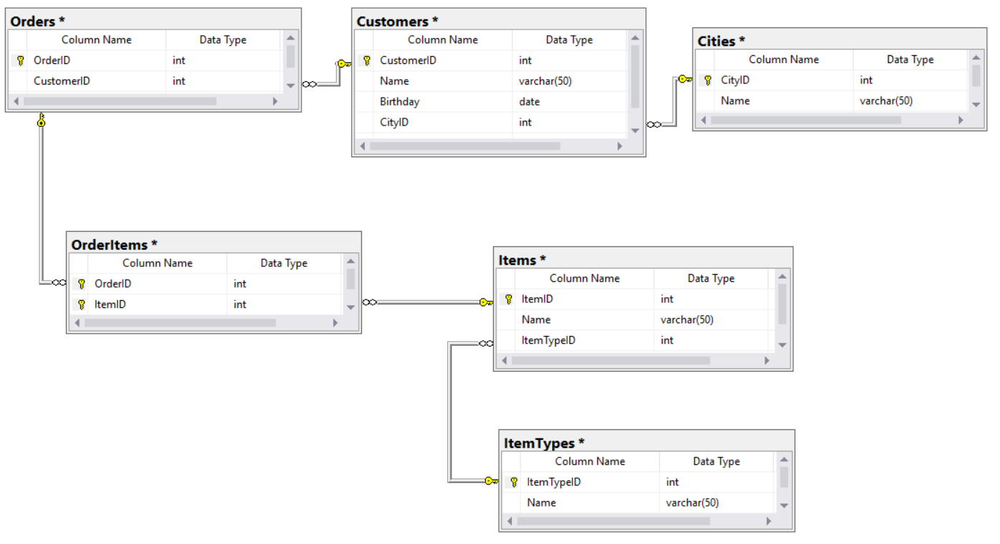
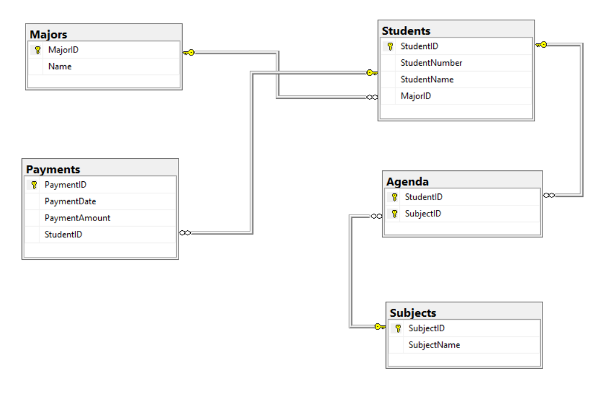

Exercises: Table Relations
==========================

This document defines the **exercise assignments** for the ["Databases Basics -
MSSQL" course \@ Software
University.](https://softuni.bg/trainings/1436/databases-basics-mssql-september-2016)

One-To-One Relationship
-----------------------

Create two tables as follows. Use appropriate data types.

| **Persons**  |               | **Passports** |                |   |                |                    |
|--------------|---------------|---------------|----------------|---|----------------|--------------------|
| **PersonID** | **FirstName** | **Salary**    | **PassportID** |   | **PassportID** | **PassportNumber** |
| 1            | Roberto       | 43300.00      | 102            |   | 101            | N34FG21B           |
| 2            | Tom           | 56100.00      | 103            |   | 102            | K65LO4R7           |
| 3            | Yana          | 60200.00      | 101            |   | 103            | ZE657QP2           |

**Insert** the data from the example above.

Alter the **customers** table and make **PersonID** a **primary key**. Create a
**foreign key** between **Persons** and **Passports** by using **PassportID**
column.

One-To-Many Relationship
------------------------

Create two tables as follows. Use appropriate data types.

| **Models**  |          | **Manufacturers**  |   |                    |          |                   |
|-------------|----------|--------------------|---|--------------------|----------|-------------------|
| **ModelID** | **Name** | **ManufacturerID** |   | **ManufacturerID** | **Name** | **EstablishedOn** |
| 101         | X1       | 1                  |   | 1                  | BMW      | 07/03/1916        |
| 102         | i6       | 1                  |   | 2                  | Tesla    | 01/01/2003        |
| 103         | Model S  | 2                  |   | 3                  | Lada     | 01/05/1966        |
| 104         | Model X  | 2                  |   |                    |          |                   |
| 105         | Model 3  | 2                  |   |                    |          |                   |
| 106         | Nova     | 3                  |   |                    |          |                   |

**Insert** the data from the example above. Add **primary keys** and **foreign
keys**.

Many-To-Many Relationship
-------------------------

Create three tables as follows. Use appropriate data types.

| **Students**  |          | **Exams** |            | **StudentsExams** |     |               |            |
|---------------|----------|-----------|------------|-------------------|-----|---------------|------------|
| **StudentID** | **Name** |           | **ExamID** | **Name**          |     | **StudentID** | **ExamID** |
| 1             | Mila     |           | 101        | SpringMVC         |     | 1             | 101        |
| 2             | Toni     |           | 102        | Neo4j             |     | 1             | 102        |
| 3             | Ron      |           | 103        | Oracle 11g        |     | 2             | 101        |
|               |          |           |            | 3                 | 103 |               |            |
|               |          |           |            | 2                 | 102 |               |            |
|               |          |           |            | 2                 | 103 |               |            |

Insert the data from the example above.  
Add **primary keys** and **foreign keys**. Have in mind that table
**StudentsExams** should have a **composite primary key**.

Self-Referencing 
-----------------

Create a single table as follows. Use appropriate data types.

| **Teachers**  |          |               |
|---------------|----------|---------------|
| **TeacherID** | **Name** | **ManagerID** |
| 101           | John     | NULL          |
| 102           | Maya     | 106           |
| 103           | Silvia   | 106           |
| 104           | Ted      | 105           |
| 105           | Mark     | 101           |
| 106           | Greta    | 101           |

Insert the data from the example above. Add **primary keys** and **foreign
keys**. The **foreign key** should be between **ManagerId** and **TeacherId**.

Online Store Database
---------------------

Create a new database and design the following structure:

University Database
-------------------

Create a new database and design the following structure:

SoftUni Design
--------------

Create an **E/R Diagram** of the SoftUni Database. There are some **special
relations** you should **check out**: Employees are **self-referenced**
(**ManagerID**) and Departments have **One-to-One** with the Employees
(**ManagerID**) while the Employees have **One-to-Many** (**DepartmentID**). You
might find it interesting how it looks on the diagram.

Geography Design
----------------

Create an **E/R Diagram** of the Geography Database.

\*Peaks in Rila
---------------

Display **all peaks** for **"Rila"** mountain. Include:

-   **MountainRange**

-   **PeakName**

-   **Elevation**

Peaks should be **sorted** by **elevation descending**.

### Example

| **MountainRange** | **PeakName** | **Elevation** |
|-------------------|--------------|---------------|
| Rila              | Musala       | 2925          |
| …                 | …            | …             |
