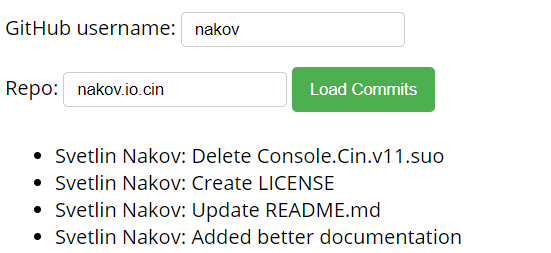
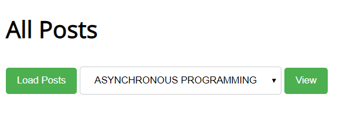
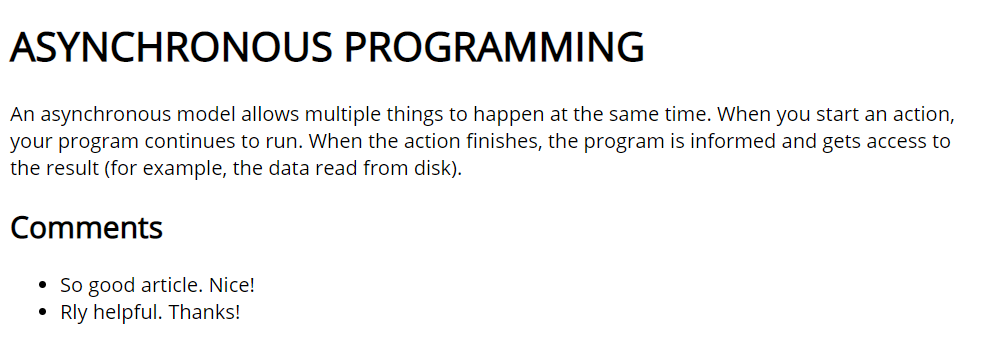

Lab: Asynchronous Programming
=============================

Problems for exercises and homework for the ["JavaScript Apps" course \@
SoftUni.](https://softuni.bg/courses/js-applications)  
The following tasks do not have tests in the Judge system. They are for
practice.

Github Commits
--------------

Write a JS program that loads all commit messages and their authors from a
github repository using a given HTML.

*Skeleton will be provided in the Resources folder.*

The **loadCommits()** function should get the **username** and **repository**
from the HTML textboxes with IDs **"username"** and **"repo"** and make a
**GET** request to the **Github API**:  
**https://api.github.com/repos/\<username\>/\<repository\>/commits**

Swap **\<username\>** and **\<repository\>** with the ones from the HTML:

-   In case of **success**, for **each** entry add a **list item** (\<**li\>**)
    in the **unordered list** (\<**ul\>**) with **id "commits"** with text in
    the following format:

>   **"\<commit.author.name\>: \<commit.message\>"**

-   In case of an **error**, add a single **list item** (\<**li\>**) with text
    in the following format:  
    **"Error: \<error.status\> (\<error.statusText\>)"**

### Screenshots:

Blog
----

Write a program for reading blog content. It needs to make **requests** to the
**server** and display **all blog posts** and their **comments**.  
Firebase URL -
[https://blog-apps-c12bf.firebaseio.com/](https://blog-apps-c12bf.firebaseio.com/$%7bendPoint%7d.json)

*Skeleton will be provided in the Resources folder.*

The button with ID "**btnLoadPosts**" should make a **GET** request to
"**/posts**". The **response** from the **server** will be an **Object of
objects.**  

Each object will be in the following format:

{

body: {postBody},

id: {postId},

title: {postTitle}

}

Create an **\<option\>** for each post using its **object key** as value and
**current object title property** as text inside the node with ID "**posts**".

When the button with ID "**btnViewPost**" is clicked, a **GET** request should
be made to:

-   "**/posts/{postId}**" to obtain the selected post (from the dropdown menu
    with ID "**posts**") - The following **request** will return **a single
    object** as described above.

-   "**/comments -** to obtain all comments. The request will **return** a
    **Object** of **objects**.  
    

    

>   Each object will be in the following format:

{

id: {commentId},

postId: {postId},

text: {commentText}

}  
You have to find this comments that are for the current post (check the postId
property)

Display the post title inside **h1** with ID "**post-title**" and the post
content inside **ul** with ID "**post-body**". Display **each comment** as a
**\<li\>** inside **ul** with ID "**post-comments**". Do not forget to clear its
content beforehand.

