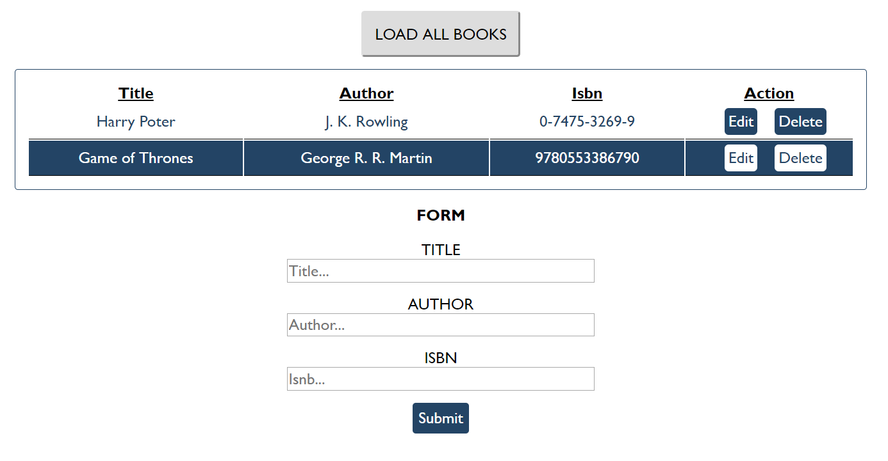
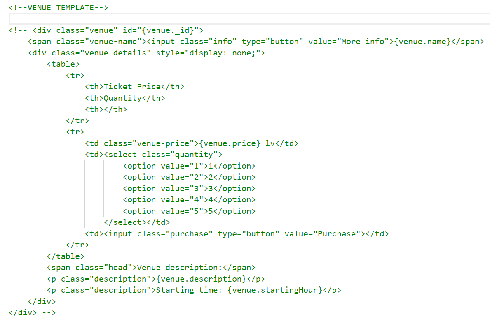
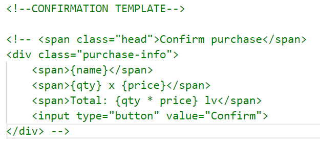
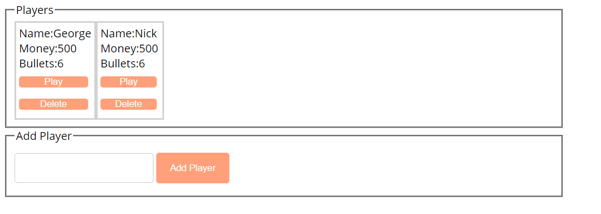
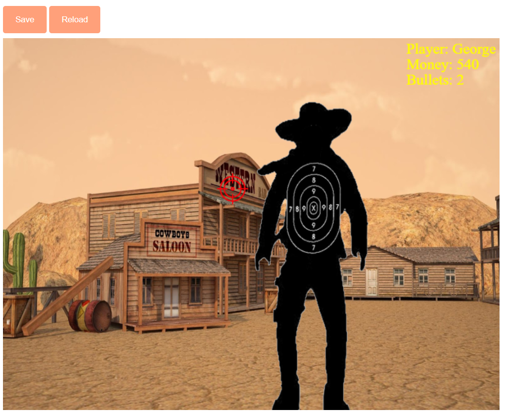

Remote Databases - Exercise
===========================

Problems for exercises and homework for the ["JavaScript Applications" course \@
SoftUni](https://softuni.bg/courses/js-apps).

For this exercuse you have to create a new application at
[kinvey.com](https://console.kinvey.com/login). And for each of the following
tasks you must create a **different collection**.

1.  **Create "Books" REST Service**

Create a collection called **books** where each book have **title, author,
isbn**.

The following REST services will be created automatically to access your data:

-   **List All Books**

    -   Endpoint:
        [https://baas.kinvey.com/appdata/[:appId]/books](https://baas.kinvey.com/apdata/%5b:appId%5d/books)

    -   Method: **GET**

    -   Headers:

        -   Basic Authorization with **user credentials**

    -   Returns (JSON)

-   **Create a New Book**

    -   Endpoint**:**
        [https://baas.kinvey.com/appdata/[:appId]/books](https://baas.kinvey.com/apdata/%5b:appId%5d/books)

    -   Method: **POST**

    -   Headers:

        -   Basic Authorization with **user credentials**

        -   Content-type: application/json

    -   Request body (JSON): **{"title":"…", "author":"…", "isbn":"…"}**

-   **Update a Book**

    -   Endpoint:
        [https://baas.kinvey.com/appdata/[:appId]/books/[:bookId]](https://baas.kinvey.com/apdata/%5b:appId%5d/books/%5b:bookId%5d)

    -   Method: **PUT**

    -   Headers:

        -   Basic Authorization with **user credentials**

        -   Content-type: application/json

    -   Request body (JSON): **{"title":"…", "author":"…", "isbn":"…"}**

-   **Delete a Book**

    -   Endpoint:
        [https://baas.kinvey.com/appdata/[:appId]/books/[:bookId]](https://baas.kinvey.com/apdata/%5b:appId%5d/books/%5b:bookId%5d)

    -   Method: **DELETE**

    -   Headers:

        -   Basic Authorization with **user credentials**

        -   Content-type: application/json

Test your REST Service, e.g. using **Postman.** Try to list all books in **JSON
format** with an **HTTP GET request** to the **REST API**.

**List All Books**

*Use the skeleton provided in resources folder*. Add an **AJAX** call that takes
all books from your application as **JSON** object and **displays** them when
the page loads.

**Create a Book**

Add an **HTML form** with **[Submit] button** for adding a new book. When the
button is **pressed**, create a **new book** using its **REST API** with an
**AJAX request**.

**Edit a Book**

Implement "**Edit a Book**" functionality. Clicking on a book should **load its
data** in an **HTML form**. By **clicking** the **[Edit]** button, the **book
data** should be **updated** at the **server side** with an **AJAX request**.

**Delete a Book**

Implement "**Delete a Book**" functionality. Each book should have a
**[Delete]** button. Clicking on it should **delete the book at the server
side** with an **AJAX request**.

**\* Add Tags for Each Book**

Implement **tags** for the books. Tags should be stored at kinvey in the Book
collection in a column "**tags**" as **array of strings**. List the tags for
each book. Implement **add** / **edit** / **delete** for tags when a book is
**created** / **updated**.

1.  **Students**

Your task is to create functionality for creating and listing students from a
database in Kinvey. Create a new collection called "**students**",

Each student has:

-   ID - number, non-empty

-   FirstName - string, non-empty

-   LastName - string, non-empty

-   FacultyNumber - string of numbers, non-empty

-   Grade - number, non-empty

You need to write functionality for creating students. When creating a new
student, make sure you name the properties accordingly. Create at least one
student to test your code.

You will also need to extract students. You will be given an **HTML template**
with a table in it. Create an **AJAX request** that extracts all the students.
Upon fetching all students from the database, add them to the table each on a
new row, **sorted** in **ascending order** by **ID**.

*Use the skeleton from the provided resources.*

**Screenshots**

1.  **Venuemaster**

Write a program that displays information about venues and allows the user to
buy a ticket.

*Use the skeleton from the provided resources.*

You can use the following Kinvey database and credentials:

App ID: kid_BJ_Ke8hZg

User: guest

Password: pass

When the user clicks on the **button** with ID "**getVenues**", take the value
of the input field with ID "**venueDate**" and make a **POST** request to:
**rpc/kid_BJ_Ke8hZg/custom/calendar?query={date}** .

The server will respond with an **array**, containing the **IDs** of all
available venues for that date. Use those IDs to obtain information from the
server about **each** of the venues - make a **GET** request to:
**appdata/kid_BJ_Ke8hZg/venues/{_id}**.

The server will respond with an object in the following format:

{

name: *String*,

description: *String*,

startingHour: *String*,

price: *Number*

}

Compose a list with all venues and display it on the page inside the **\<div\>**
with ID "**venue-info**". Use **template for one venue is the comment section
inside the html file.**

Each item in the list has a button **[More info]** that changes the visibility
of the detailed description for the corresponding venue:

-   Hide all descriptions (set style to "**display: none**")

-   Show the current description (set style to "**display: block**").

The detailed view has a numeric drop-down and a button **[Buy tickets]**. When
this button is clicked, take the user to the confirmation page - change the
content of the "**\#venue-info**" div, using the **comment confirmation template
in htlm file.**

The final step is the confirmation of the purchase - when the user clicks on the
**button** with **ID** "**confirm**", make a **POST** request to:
**rpc/kid_BJ_Ke8hZg/custom/purchase?venue={_id}&qty={qty}**

The server will return an object, containing an HTML fragment in its html
property. Display that fragment inside "**\#venue-info**" along with the
following text:  
"**You may print this page as your ticket**".

**Hints**

The service at the given address will respond with valid information for dates
"**23-11**", "**24-11**", "**25-11**", "**26-11**" and "**27-11**", in this
exact format.

**Examples**

1.  **\*\*\*Secret Knock (Not required)**

Your task is to perform the Secret Knock. The Secret Knock is a secret knocking
technique that is performed with **requests**, **responses** and **promises**.

The credentials that you need to use for Kinvey database are:

-   App id / key: kid_BJXTsSi-e

-   App secret: 447b8e7046f048039d95610c1b039390

The guest user is:

-   Username: guest

-   Password: guest

You will need to **log in** before you perform any kind of action. Then you will
have to send various requests **with queries** - a query is a list **of
parameters added to the URL** of the request. Here is the base URL for the
requests:

<https://baas.kinvey.com/appdata/kid_BJXTsSi-e/knock>

You have to add the **first query**, which is “Knock Knock” to the URL. It
should look like this:

[https://baas.kinvey.com/appdata/kid_BJXTsSi-e/knock?query=Knock
Knock](https://baas.kinvey.com/appdata/kid_BJXTsSi-e/knock?query=Knock%20Knock)

If you send a **GET request** to this URL, you will receive a response with an
**answer** from the server, and the **next message**. Change the **query** with
the **next message** in line, and continue this process until you receive a
response **with no next message**. Print the **answer** and the **next message**
after each **successful request** on the console.

1.  **\*\*\*Wild Wild West (Not required)**

Write **REST services** for a simple Western game. Create a collection **players
(name, money, bullets)** to hold information about the players in the game.

-   name - string representing the name of the current player.

-   money - integer number representing the current player’s money.

-   bullets - integer number representing the current bullets of the player.

**HTML and JS**

You will be provided with a skeleton project containing an **HTML template** and
some **JS files**. The **loadCanvas.js** is a simple implementation for the game
and your job is to **attach events** to all the buttons and make the needed
**AJAX requests**.

When the page is loaded a **GET** request should be sent to the server to get
all players and load them in the **div** with **ID players**. An example entry
is left in the HTML to demonstrate the representation of a player and their
placement.

Whenever the **[Save]** button is pressed, the progress of the current player
(if any) should be saved (a **PUT** request sent to the server with the new
data):

-   The **canvas** and buttons **[Save]** and **[Reload]** should be **hidden**

-   The **clearInterval** should be called on the **canvas.intervarId** property
    (used for the main loop of the game)

Whenever the **[Reload]** button is pressed, the player’s money should be
**reduced by 60** and their bullets should be **set to 6**.

Whenever the **[Add Player]** button is clicked, a new Player with the name
specified in the corresponding input should be created and the players should be
reloaded to display the new entry. Each new player **starts** with **500 Money**
and **6 bullets**.

Pressing the **[Play]** button on a player should:

-   Call the **[Save]** button

-   Display the **canvas**, **[Save]** and **[Reload]** buttons

-   Call the **loadCanvas()** function (from the **loadCanvas.js**)

-   Pass to it the **new player** as an **object** (containing properties
    **name**, **money** and **bullets**)

When a player’s **[Delete]** button is pressed, the player should be deleted
(both from the HTML and from the server).

**Examples**

